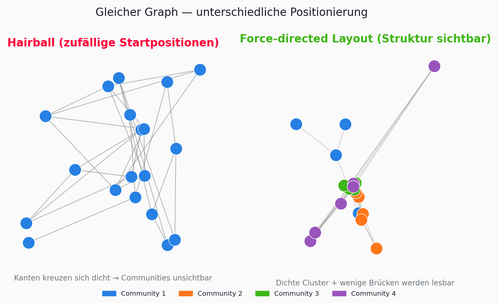
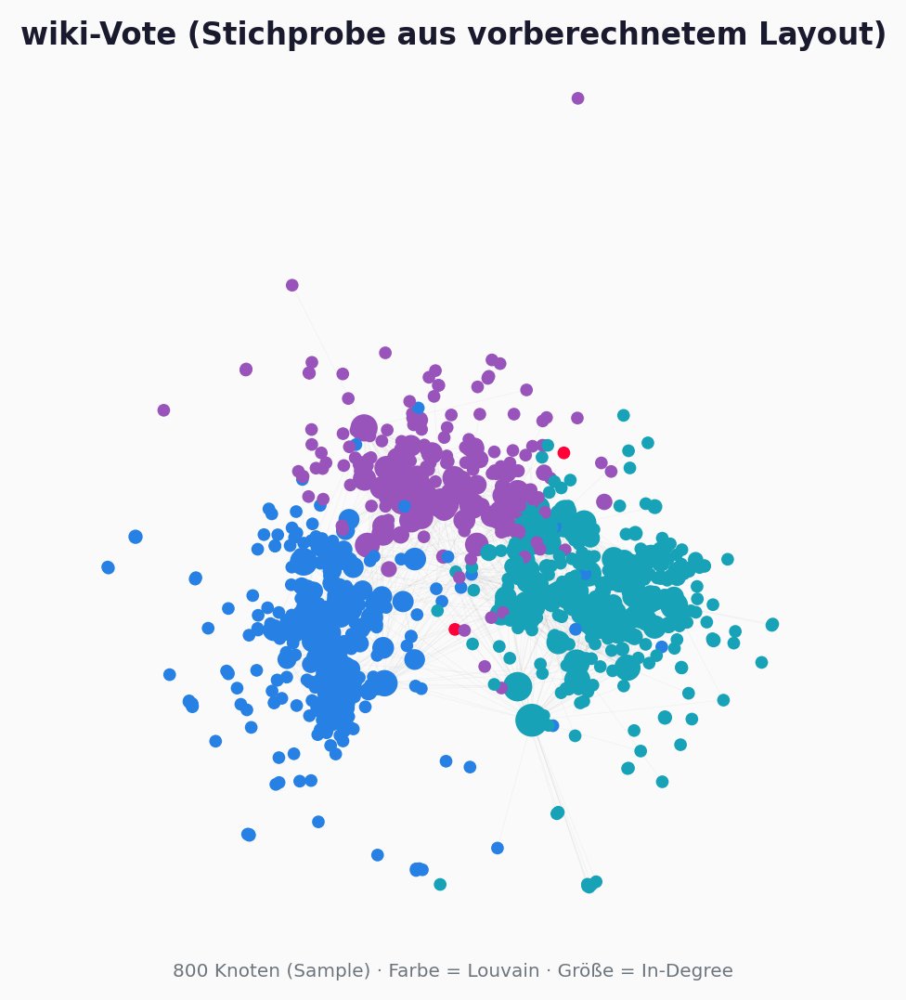
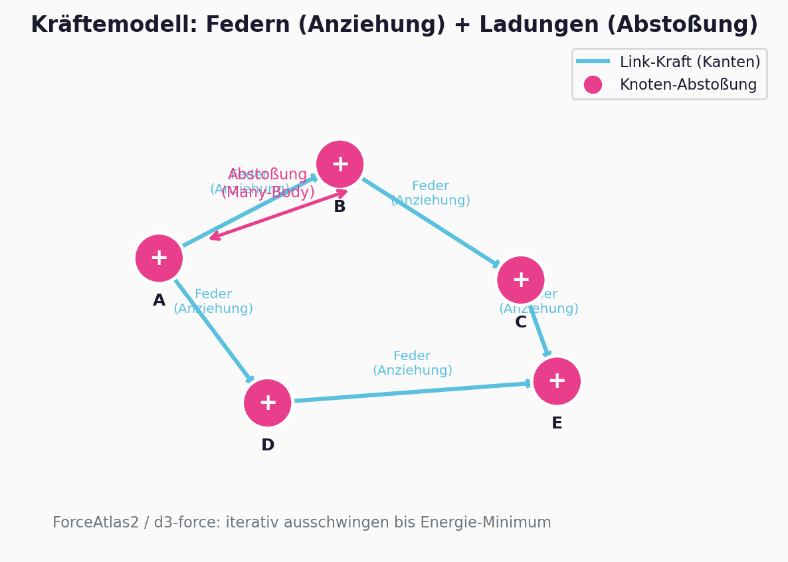
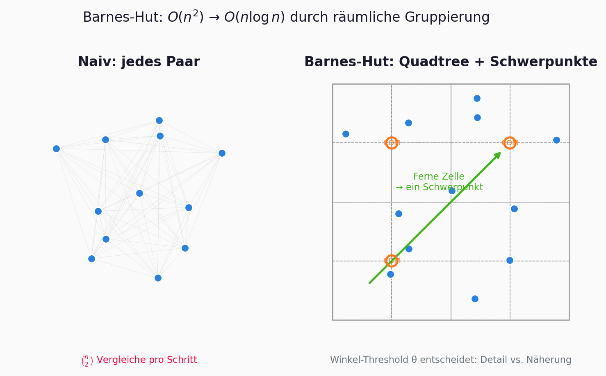
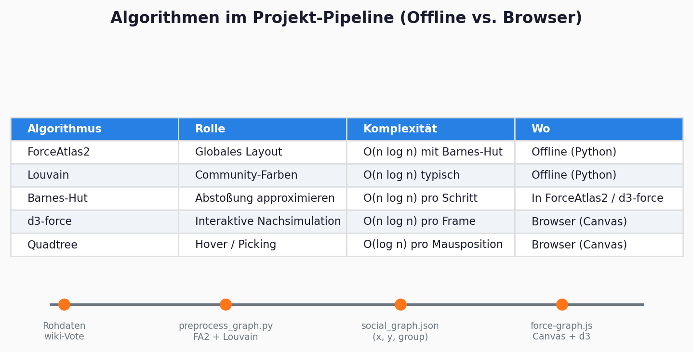
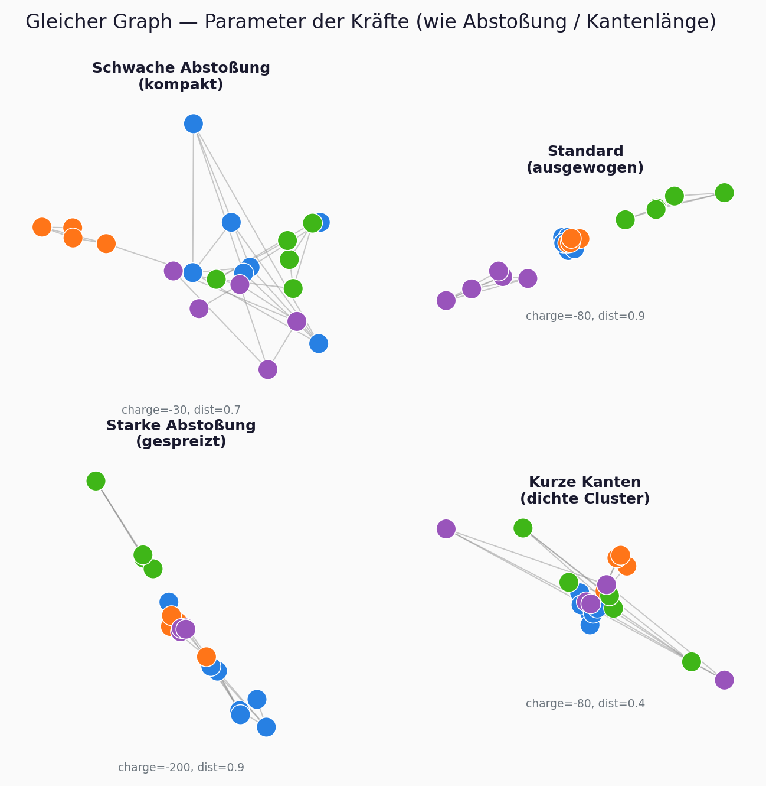
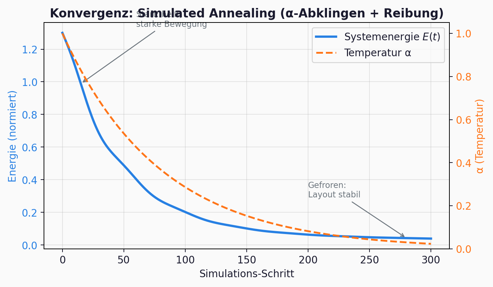
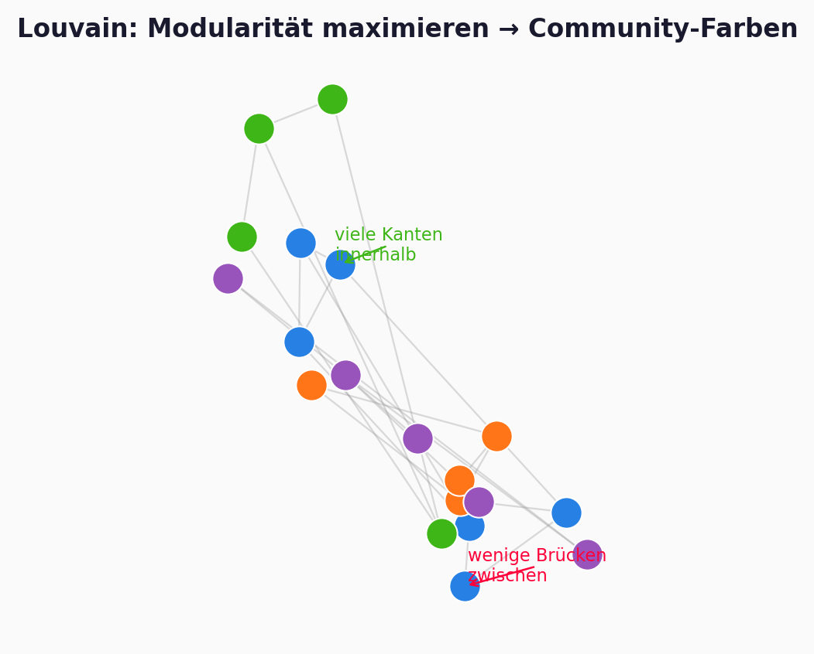
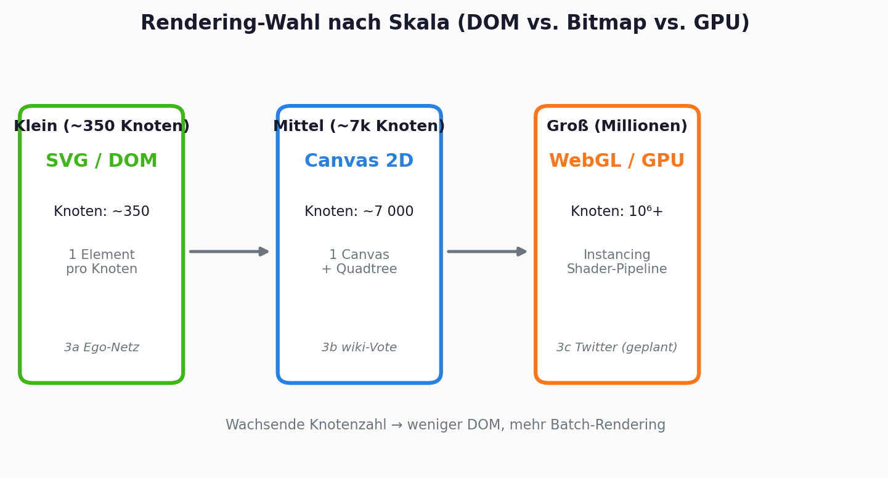
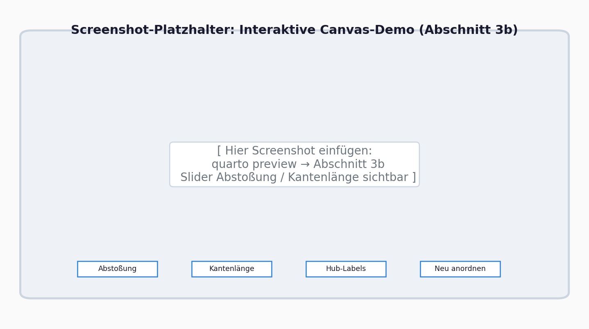

# DEPRECATED - superseded by presentation.qmd (v2)

# Presentation source (copy to `presentation.qmd`)

Rename or copy this file to `presentation/presentation.qmd` and add the YAML header below at the top.

```yaml
---
title: "Nodale Graphdatenvisualisierung"
subtitle: "Layout-Algorithmen, Kraftmodelle und Web-Rendering"
author: "Sara, Silvia, Adam"
date: today
format:
  revealjs:
    theme: simple
    slide-number: true
    transition: slide
    width: 1280
    height: 720
    footer: "Visual Computing · Vertiefung · HM München"
bibliography: ../references.bib
---
```

---

## Lernziele

Nach dieser Präsentation könnt ihr …

- erklären, **warum** große Graphen ohne Layout-Algorithmen unlesbar werden
- das **Kraftmodell** (Federn + Abstoßung) und die **Barnes-Hut-Näherung** skizzieren
- **ForceAtlas2**, **Louvain** und **d3-force** in eure Pipeline einordnen
- begründen, wann **SVG**, **Canvas** oder **WebGL** sinnvoll sind

---

## Agenda (25 Min)

| Block | Inhalt |
|-------|--------|
| Problem & Motivation | Hairball, wiki-Vote |
| Brücke | Gestalt → Layout (1 Folie) |
| **Kern** | Kraftmodelle, Barnes-Hut, FA2, Louvain |
| **Live-Demo** | Interaktive Website (Abschnitt 3b) |
| Ausblick | Skalierung, Grenzen, Quiz |

---

# Problem & Motivation

---

## Wann wird ein Graph unlesbar?



---

## Use-Case: Soziale Netzwerke

- **Knoten** = Akteure, **Kanten** = Beziehungen
- Ziel: **Struktur sichtbar machen** - Communities, Hubs, Brücken
- Beispiel: **wiki-Vote** (~7.000 Nutzer, ~100.000 Kanten, SNAP)



---

## Entwicklungsgeschichte (Kurzüberblick)

| Jahr | Meilenstein |
|------|-------------|
| 1984 | Eades - Feder-Heuristik |
| 1991 | Fruchterman-Reingold |
| 1986 | Barnes-Hut |
| 2008 | Louvain |
| 2014 | ForceAtlas2 |
| heute | d3-force, Canvas, WebGL |

---

# Brücke zur Vorlesung

---

## Gestalt → Layout

**Gesetz der Nähe (Vorlesung):** Nahe Elemente = zusammengehörig.

**Kraft-Layout:** Algorithmen **konstruieren** diese Nähe durch Positionierung.

---

# Kraftgerichtete Layouts

---

## Graph als physikalisches System



- Attraktion entlang Kanten (Federn)
- Abstoßung zwischen allen Knoten
- Layout = Kräftegleichgewicht

---

## Feder- und Abstoßungskräfte

$$F_{ij}^{\mathrm{attr}} = k \cdot (d_{ij} - l) \cdot \vec{u}_{ij}$$

$$F_{ij}^{\mathrm{rep}} = \frac{k_{\mathrm{rep}}}{d_{ij}^{2}} \cdot \frac{\mathbf{x}_i - \mathbf{x}_j}{d_{ij}}$$

---

## Energie-Formulierung

$$E = \sum_{(i,j)\in E} \frac{k}{2}(d_{ij} - l)^2 + \sum_{i<j} \frac{k_{\mathrm{rep}}}{d_{ij}}$$

Referenz: Eades 1984, Fruchterman-Reingold 1991

---

## FR vs. ForceAtlas2

| Aspekt | FR | FA2 |
|--------|----|-----|
| Abstoßung | $O(n^2)$ | Barnes-Hut |
| Integration | Euler + $T$ | Verlet + $\alpha$ |

---

## Barnes-Hut



$\Theta$-Kriterium: Zelle approximieren wenn $w/d < \Theta$

---

## Pipeline



`preprocess_graph.py` → FA2 + Louvain → JSON → d3-force Canvas

---

## Parameter-Effekte



---

## Velocity-Verlet & alpha-Decay



---

## Louvain & Hubs



$$Q = \frac{1}{2m} \sum_{ij} \left[ A_{ij} - \frac{k_i k_j}{2m} \right] \delta(c_i, c_j)$$

---

# Skalierung

---

## SVG → Canvas → WebGL



---

# Live-Demo

---

## Website Abschnitt 3b



---

# Abschluss

---

## Zusammenfassung

Physik simulieren · N-Körper approximieren · Communities färben · passend rendern

---

## Quiz

1. Warum Barnes-Hut?
2. Was bedeutet hohes $Q$?
3. Warum Canvas statt SVG?
4. Was steuert $\alpha$?

---

## Arbeitsaufteilung

| Sara | … |
| Silvia | … |
| Adam | … |
