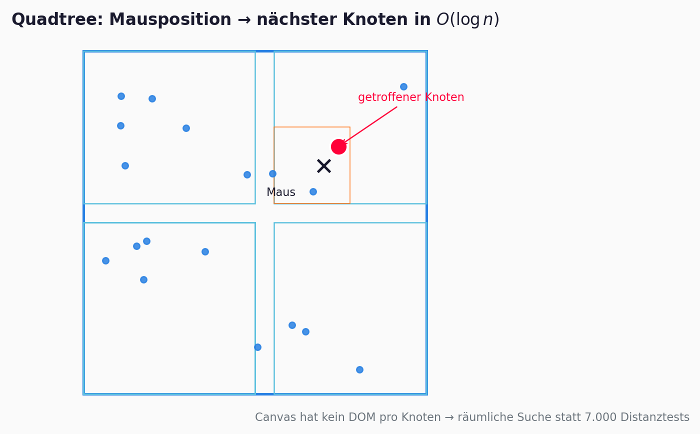

## Nodale Graphdatenvisualisierung

Layout-Algorithmen, Kraftmodelle und Web-Rendering

Visual Computing · Vertiefung · HM München

::: {.notes}
Folie 1/34 · 0:30 · Titel setzen, Team vorstellen.
:::

## Lernziele

Nach dieser Präsentation könnt ihr …

- erklären, **warum** große Graphen ohne Layout-Algorithmen unlesbar werden
- das **Kraftmodell** (Federn + Abstoßung) und **Barnes–Hut** skizzieren
- **ForceAtlas2**, **Louvain** und **d3-force** in eurer Pipeline einordnen
- begründen, wann **SVG**, **Canvas** oder **WebGL** sinnvoll sind
- **State-of-the-Art** (2016–2026) einordnen: GPU, WebGPU, ML-Layouts, VR

::: {.notes}
Folie 2/34 · 0:45 · Messbare Outcomes — nicht vorlesen, nur skizzieren.
:::

## Agenda (25 Min)

| Min | Block |
|-----|-------|
| 0–6 | Problem, Motivation, Geschichte |
| 6–17 | Kraftmodelle, FA2, Barnes–Hut, Louvain |
| 17–23 | Skalierung, **Live-Demo** |
| 23–27 | Grenzen, **State of the Art 2016–2026** |
| 27–30 | Zusammenfassung, Quiz, Team |

::: {.notes}
Folie 3/34 · 0:45 · SOTA-Block (~4 Min) — in Dry-Run kürzbar auf Folien 24+30.
:::

# Problem & Motivation

## Wann wird ein Graph unlesbar?

{width="95%"}

**Lesbarkeit ≠ Vollständigkeit** — alle Knoten sichtbar heißt nicht, dass man Struktur erkennt.

::: {.notes}
Folie 4/34 · 1:00 · Hairball vs. Force-Layout. Übergang: „Konkret an wiki-Vote …"
:::

## Use-Case: wiki-Vote (SNAP)

- **Knoten** = Wikipedia-Nutzer · **Kanten** = Admin-Wahlen
- ~**7.000** Knoten, ~**100.000** Kanten
- Ziel: **Communities**, **Hubs**, globale Struktur sichtbar machen

{width="68%"}

::: {.notes}
Folie 5/34 · 1:15 · Orga: Use-Cases & Motivation. Farbe/Größe kommen später.
:::

## Entwicklungsgeschichte

| Jahr | Meilenstein |
|------|-------------|
| 1984 | Eades — Feder-Heuristik [@eades1984] |
| 1986 | Barnes–Hut — $O(n \log n)$ [@barnes1986] |
| 1991 | Fruchterman–Reingold [@fruchterman1991] |
| 2008 | Louvain — Communities [@blondel2008] |
| 2014 | ForceAtlas2 [@jacomy2014] |
| heute | d3-force im Browser [@bostock2016] |

::: {.notes}
Folie 6/34 · 1:00 · Verwandte Arbeiten (Orga). Nicht jede Methode im Detail.
:::

## Brücke zur Vorlesung: Gestalt → Layout

::: {.columns}
::: {.column width="48%"}
**Gesetz der Nähe** *(vc_vis)*

Nahe Elemente wirken **zusammengehörig**.
:::

::: {.column width="48%"}
**Kraft-Layout**

Algorithmen **konstruieren** räumliche Nähe — verbundene Gruppen wandern zusammen.
:::
:::

::: {.notes}
Folie 7/34 · 0:45 · Einzige vc_vis-Referenz. Kein Tufte/WWH.
:::

# Kraftgerichtete Layouts

## Graph als physikalisches System

{width="88%"}

- **Kanten** = Federn (Anziehung)
- **Knoten** = gleichnamige Ladungen (Abstoßung)
- Layout = **Kräftegleichgewicht**

::: {.notes}
Folie 8/34 · 1:00 · Noch keine Formeln — Intuition zuerst (Prof-Stil).
:::

## Federkraft (Attraktion)

**Intuition:** Nachbarn sollen nah beieinander liegen — aber nicht unendlich.

$$F_{ij}^{\mathrm{attr}} = k \cdot (d_{ij} - l) \cdot \vec{u}_{ij}$$

$d_{ij} = \|\mathbf{x}_i - \mathbf{x}_j\|$, $\vec{u}_{ij}$ = Richtung von $i$ nach $j$

::: {.notes}
Folie 9/34 · 1:00 · Zu weit → Anziehung; zu nah entlang Kante → leichte Abstoßung.
:::

## Abstoßung & Gesamtkraft

**Intuition:** Ohne Abstoßung kollabieren alle Knoten im Zentrum.

$$F_{ij}^{\mathrm{rep}} = \frac{k_{\mathrm{rep}}}{d_{ij}^{2}} \cdot \frac{\mathbf{x}_i - \mathbf{x}_j}{d_{ij}}$$

$$\mathbf{F}_i = \sum_{j \in N(i)} \mathbf{F}_{ij}^{\mathrm{attr}} + \sum_{j \neq i} \mathbf{F}_{ij}^{\mathrm{rep}}$$

::: {.notes}
Folie 10/34 · 1:00 · Many-Body: jedes Paar — das wird teuer (nächste Folie: Energie).
:::

## Energie-Minimierung

**Intuition:** Kräfte sind der negative Gradient einer Energie $E$.

$$E = \sum_{(i,j)\in E} \frac{k}{2}(d_{ij} - l)^2 + \sum_{i<j} \frac{k_{\mathrm{rep}}}{d_{ij}}$$

@eades1984 · @fruchterman1991

::: {.notes}
Folie 11/34 · 1:00 · Layout = lokales Minimum von $E$, nicht globales Optimum.
:::

## Fruchterman–Reingold vs. ForceAtlas2

**Was macht FA2?** Kontinuierliches Layout für **große** reale Netzwerke.

| Aspekt | FR | ForceAtlas2 |
|--------|----|----|
| Abstoßung | $O(n^2)$ alle Paare | Barnes–Hut |
| Integration | Euler + $T$ | Verlet + $\alpha$ |

$F_{ij}^{\mathrm{rep}} = k \frac{1 + w_{ij}}{d_{ij}}$ (FA2, vereinfacht) · @jacomy2014

::: {.notes}
Folie 12/34 · 1:15 · FR = Klassiker; FA2 = unsere Offline-Pipeline.
:::

## Barnes–Hut: $O(n^2) \to O(n \log n)$

{width="92%"}

Bei $n = 7{,}000$: **~25 Mio.** Knotenpaare pro Schritt (naiv)

$$\frac{w}{d} < \Theta \Rightarrow \text{ferne Zelle als Schwerpunkt approximieren}$$

::: {.notes}
Folie 13/34 · 1:15 · @barnes1986 · $\Theta$ klein = genauer, groß = schneller.
:::

## Offline-Pipeline (Website)

{width="95%"}

`preprocess_graph.py` → ForceAtlas2 + Louvain → `social_graph.json` → d3-force (Canvas)

::: {.notes}
Folie 14/34 · 1:00 · Orga: Funktionsprinzip unter der Haube. Offline = schneller Seitenstart.
:::

## Layout-Parameter

{width="92%"}

Gleicher Graph — verschiedene **Abstoßung** und **Kantenlänge** (wie in der Demo).

::: {.notes}
Folie 15/34 · 0:45 · Foreshadow Live-Demo-Slider.
:::

## d3-force: Velocity-Verlet & $\alpha$-Decay

{width="88%"}

$$\mathbf{v}_{t+\frac{\Delta t}{2}} = \mathbf{v}_t + \frac{\Delta t}{2}\mathbf{a}_t, \quad \mathbf{x}_{t+\Delta t} = \mathbf{x}_t + \Delta t \cdot \mathbf{v}_{t+\frac{\Delta t}{2}}$$

$$\alpha_{t+1} = \alpha_t(1-\rho), \quad \mathbf{F}_i^{\mathrm{eff}} = \alpha \cdot \mathbf{F}_i$$

::: {.notes}
Folie 16/34 · 1:15 · Simulated Annealing — erklärt warum „Neu anordnen" wenig bewegt (FA2-Startlayout).
:::

## Louvain & Hubs (visuelles Encoding)

{width="85%"}

$$Q = \frac{1}{2m} \sum_{ij} \left[ A_{ij} - \frac{k_i k_j}{2m} \right] \delta(c_i, c_j)$$

**Farbe** = Louvain · **Größe** = In-Degree · @blondel2008

::: {.notes}
Folie 17/34 · 1:00 · $Q > 0$ = mehr innere als erwartete Kanten. 15 Communities im Datensatz.
:::

## Komplexität (Überblick)

| Algorithmus | Pro Iteration | Gesamt (typ.) |
|-------------|---------------|---------------|
| FR (naiv) | $O(n^2)$ | $O(n^3)$ |
| FA2 + Barnes–Hut | $O(n \log n)$ | $O(n^2 \log n)$ |
| d3-force | $O(n \log n)$ | interaktiv |
| Louvain | — | $O(n \log n)$ |
| SVG vs. Canvas | DOM vs. Pixel | siehe nächste Folie |

::: {.notes}
Folie 18/34 · 0:45 · Rendering-Kosten separat betrachten.
:::

# Skalierung & Demo

## SVG → Canvas → WebGL

{width="95%"}

| Abschnitt | Größe | Technologie |
|-----------|-------|-------------|
| 3a Ego-Netz | ~350 | SVG / DOM |
| **3b wiki-Vote** | ~7.000 | **Canvas** |
| 3c Follow-Graph | $10^6+$ | WebGL (geplant) |

::: {.notes}
Folie 19/34 · 1:00 · Website-Skalierung in einem Bild — 3a/3c nur erwähnen.
:::

## Quadtree: Interaktion auf Canvas

{width="88%"}

Kein DOM pro Knoten → **räumliche Suche** in $O(\log n)$ statt 7.000 Distanztests.

::: {.notes}
Folie 20/34 · 0:45 · Aus Website Abschnitt 3b — Quadtree in force-graph.js.
:::

## Live-Demo — wiki-Vote (Website 3b)

{width="90%"}

**Jetzt live:** Interaktiver Graph — Hover, Zoom, Slider, „Neu anordnen"

::: {.notes}
Folie 21/34 · 0:30 · Browser öffnen (quarto preview oder deployed site).
:::

## Demo-Skript (4 Min)

| Zeit | Aktion |
|------|--------|
| 0:00 | Gesamtgraph — Farbe = Louvain, Größe = In-Degree |
| 0:40 | Hover Hub — Nachbarschaft + rote Kanten |
| 1:20 | Zoom in den Hairball-Kern |
| 2:00 | Slider **Abstoßung** ↑ |
| 2:40 | Slider **Kantenlänge** ↓ |
| 3:10 | **Neu anordnen** — $\alpha$-Erwärmung |
| 3:40 | **Hub-Labels** einblenden |

::: {.notes}
Folie 22/34 · 3:30 · Orga: Live-Demo. Bei Netzproblemen: fig08 + fig07 als Fallback.
:::

# Abschluss

## Grenzen (unser Ansatz)

- **Hairball** bleibt bei sehr dichten Graphen — Filter/Aggregation nötig
- **Lokale Minima** — kein garantiertes globales Optimum
- **Gerichtete Kanten** — 100k Pfeile unlesbar → ungerichtete Projektion fürs Layout

::: {.notes}
Folie 23/34 · 0:45 · Orga: Grenzen. Übergang: „Was passiert jenseits unseres Stacks?"
:::

# State of the Art (2016–2026)

## Forschungsfeld heute

Meta-Survey **„Are We There Yet?"** (2023): Netzwerk-Visualisierung fragmentiert in [@nobre2023]

- **Large graphs** — Skalierung (unser Schwerpunkt)
- **Dynamic / multivariate / geospatial** — weiter offen
- Taxonomie: pre-/in-/post-layout Optimierung [@wang2023survey]

::: {.notes}
Folie 24/34 · 0:50 · Web Research Agent. Quellen in briefings/web-research-sota-2016-2026.md
:::

## GPU: Layout jenseits von wiki-Vote

| Ansatz | Idee | Größenordnung |
|--------|------|---------------|
| **RAPIDS cuGraph FA2** | CUDA ForceAtlas2, zero-copy GPU pipeline | bis ~50M Knoten |
| **GraphWaGu** | WebGPU: FR + Barnes–Hut parallel im Browser | 100k Knoten @ ≥10 FPS |
| **RTX „Springs"** | Abstoßung via Ray-Tracing statt Quadtree | 4–13× vs. CUDA BH |

@cugraph2020 · @graphwagu2023 · @wald2020springs

::: {.notes}
Folie 25/34 · 1:00 · Vergleich zu unserem offline FA2 + Canvas.
:::

## Browser-Ökosystem: WebGL → WebGPU

| Tool | Jahr | Layout | Render |
|------|------|--------|--------|
| NetV.js | 2020 | extern (D3) | WebGL |
| **Unser 3b** | 2026 | offline FA2 + d3-force | Canvas |
| GraphWaGu / GraphGPU | 2023+ | WebGPU compute | WebGPU |
| Cosmograph | 2023+ | FA im Browser | GPU + DuckDB |

**Graphistry:** Server-GPU + Arrow → WebGL-Stream (bis ~8M Kanten) [@graphistry2020]

::: {.notes}
Folie 26/34 · 0:55 · Wir sind didaktische Zwischenstufe vor WebGPU-All-in-One.
:::

## Hairball reduzieren — jenseits von Layout

Wenn Kraft allein nicht reicht (2018–2020):

- **Edge Cutting** — skelettartiges Layout durch gezieltes Kantenentfernen [@edge2018hairball]
- **Edge Bundling (SBED)** — ähnlichkeitsbasiert, multiscale Overview [@sbed2020]
- **ChordLink** — Node-link + Chord-Diagramme für dichte Communities [@angori2019chordlink]

Ergänzt Louvain-Farben — nicht Ersatz für FA2.

::: {.notes}
Folie 27/34 · 0:55 · Post-layout / hybrid — passt zu Website-Abschnitt 3c Reduktion.
:::

## ML-Layouts: GNN & Dimensionality Reduction

| Methode | Jahr | Kernidee |
|---------|------|----------|
| **DRGraph** | 2020 | DR + negative sampling, $O(n)$, multilevel [@zhu2020drgraph] |
| **(DNN)²** | 2021 | GCN optimiert Layout-Loss direkt [@dnn2_2021] |
| **NeuLay** | 2023 | GNN beschleunigt FDL 10–100×, oft klarere Communities [@neulay2023] |

**Trend:** Physik (FA2) + Lernen (GNN) — nicht entweder/oder.

::: {.notes}
Folie 28/34 · 1:00 · Nature Communications 2023 — starker Anker für „Ausblick".
:::

## Immersiv & Multilevel

- **Multilevel FDP** (Multi-GiLA, MuGDAD): Coarsening → Platzierung → Verfeinerung für Cluster [@multigila2016]
- **VR Graph Analytics:** GAV-VR Framework (2023), egocentrische Navigation, ästhetik-gesteuerte Viewpoints [@gavvr2023]
- **3D-Layouts:** NeuLay legte Internet-Topologie in 3D aus [@neulay2023]

::: {.notes}
Folie 29/34 · 0:50 · Optional kürzen bei Zeitdruck.
:::

## Wo stehen wir?

| | **Unser Projekt** | **SOTA 2016–26** |
|--|-------------------|------------------|
| Layout | FA2 offline + d3-force | cuGraph, WebGPU, NeuLay GNN |
| Skalierung | ~7k (Canvas) | 100k–50M (GPU) |
| Hairball | Louvain + In-Degree | + Cutting, Bundling, Hybrid |
| Rendering | Canvas 2D | WebGL / WebGPU |
| Immersiv | — | VR-Frameworks |

::: {.notes}
Folie 30/34 · 0:45 · Brücke zurück zur Zusammenfassung — nicht unter Wert verkaufen.
:::

## Zusammenfassung

> **Physik simulieren · N-Körper approximieren · Communities färben · passend rendern**

1. Kraft-Layouts machen Struktur **räumlich** lesbar
2. Barnes–Hut + offline FA2 machen **große** Graphen berechenbar
3. Louvain + In-Degree kodieren **Bedeutung**
4. Canvas + Quadtree halten **Interaktion** flüssig

::: {.notes}
Folie 31/34 · 0:45 · Merksatz wiederholen.
:::

## Lernzielabfrage (Quiz)

1. Warum braucht ForceAtlas2 Barnes–Hut?
2. Was bedeutet hohe Modularität $Q$?
3. Warum Canvas statt SVG bei wiki-Vote?
4. Was steuert $\alpha$ in d3-force?

::: {.notes}
Folie 32/34 · 1:00 · Antworten: (1) $O(n^2)\to O(n\log n)$ (2) mehr innere Kanten (3) kein 100k-DOM (4) Kühlparameter. Bonus: „Was ist NeuLay?" → GNN-beschleunigtes FDL.
:::

## Arbeitsaufteilung

| Person | Präsentation | Webseite | Code / Daten |
|--------|--------------|----------|----------------|
| **Sara** | … | … | … |
| **Silvia** | … | … | … |
| **Adam** | … | … | … |

::: {.notes}
Folie 33/34 · 0:30 · Orga-Pflicht — vor Abgabe ausfüllen!
:::

## Fragen?

Graphdatenvisualisierung · [SNAP wiki-Vote](https://snap.stanford.edu/data/wiki-Vote.html)

::: {.notes}
Folie 34a · Peer-Review: „WebGPU vs. Canvas?" / „Wann GNN statt FA2?"
:::

# Referenzen

::: {#refs}
:::

::: {.notes}
Folie 34b · 0:15 · Bibliographie inkl. SOTA 2016–26.
:::
