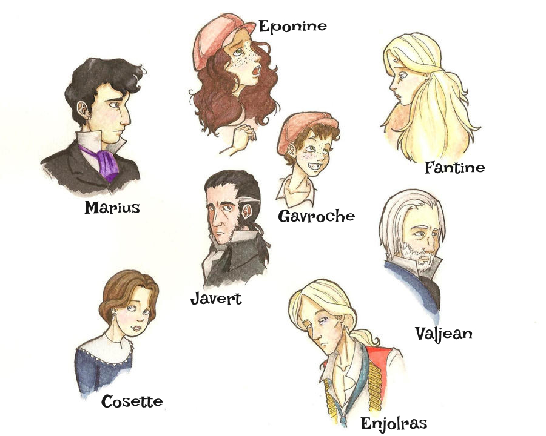

# Kleiner Datensatz – Les Misérables

### Les Misérables Graph

Der Datensatz basiert auf den Beziehungen der Figuren aus dem Roman Les Misérables. Er umfasst insgesamt 77 Knoten, wobei jeder Knoten eine einzelne Figur aus der Geschichte repräsentiert. Untenstehend sind die Hauptcharaktere dargestellt:
<div class="image-container">



</div>

Die 77 Figuren sind durch 254 Kanten miteinander verbunden, die jeweils eine gemeinsame Szene oder eine direkte Interaktion zwischen zwei Charakteren darstellen. Die Verbindungen sind ungerichtet, das heißt, sie besitzen keine feste Richtung, sondern beschreiben lediglich die Existenz einer Beziehung zwischen zwei Figuren.

Durch diese Struktur entsteht ein klassisches Netzwerk aus Entitäten und Beziehungen, das sich besonders gut für die Visualisierung von Graphalgorithmen eignet. Der Datensatz ist bewusst klein gehalten, sodass sich jeder einzelne Schritt eines Layout-Verfahrens gut nachvollziehen lässt. Dadurch kann beobachtet werden, wie aus einer reinen Liste von Knoten und Kanten schrittweise eine räumliche Struktur entsteht und sich Muster, Cluster und zentrale Figuren im Verlauf der Berechnung herausbilden.

## Die Rohdaten

Noch bevor ein Algorithmus arbeitet, besteht ein Graph lediglich aus einer Liste von Knoten und Kanten. Zu diesem Zeitpunkt gibt es keine räumliche Ordnung und keine visuelle Struktur, sondern ausschließlich die Information darüber, welche Elemente miteinander verbunden sind.

Ein Graph beschreibt somit zunächst nur Beziehungen zwischen Objekten, jedoch nicht deren Position im Raum. Die räumliche Anordnung entsteht erst durch einen späteren Layout-Algorithmus.

Das bedeutet konkret:

- es existieren keine Koordinaten
- es gibt keine geometrische Struktur
- die Darstellung besteht ausschließlich aus Verbindungen zwischen Knoten.

Eine Liste aller Verbindungen aus dem Roman Les Misérables ist hier dargestellt

<div id="graph-step1"></div>

Abbildung 1: Übersicht der Rohdaten als Kantenliste (alle Verbindungen zwischen Knoten).

<details class="acc">

<summary>

<span class="acc-toggle"></span>
<span class="acc-title">Wie D3 einen Graphen intern speichert</span>
<span class="acc-tag tag-impl">Implementierung</span>
</summary>

<div class="acc-body">

Ein Graph wird typischerweise als JSON gespeichert.

```json
{
  "nodes": [
    { "id": "A" },
    { "id": "B" }
  ],
  "links": [
    { "source": "A", "target": "B" }
  ]
}
```

Dabei gilt:

- nodes enthält alle Elemente des Graphen
- links beschreibt die Beziehungen zwischen diesen Elementen
- source und target definieren jeweils eine Verbindung zwischen zwei Knoten

Während der Simulation ersetzt D3 diese abstrakten Verweise intern durch konkrete Objekte mit zusätzlichen Eigenschaften wie x, y, vx und vy. Dadurch kann der Graph dynamisch berechnet und animiert werden.
</div> </details>

## Schritt 2 - Was passiert damit?

Die gleichen Knoten werden nun zufällig im Raum verteilt. Obwohl alle Informationen über die Verbindungen vollständig vorhanden sind, entsteht dabei keine sinnvolle räumliche Struktur.

Jeder Knoten erhält lediglich eine beliebige Position innerhalb der Zeichenfläche, unabhängig davon, ob er stark oder schwach mit anderen Knoten verbunden ist. Dadurch wird die eigentliche Informationsstruktur des Graphen nicht sichtbar gemacht, sondern durch die zufällige Platzierung überdeckt.

In dieser Darstellung findest du auch unsere Hauptfiguren wieder, klicke auf den Button, um sie sichtbar zu machen.

<div id="graph-step2"></div>

Abbildung 2: Zufällige Anordnung der Knoten zur ersten visuellen Orientierung.

<details class="acc"> <summary>
<span class="acc-toggle"></span>
<span class="acc-title">Warum zufällige Koordinaten keine Information enthalten</span>
<span class="acc-tag tag-konzept">Konzept</span>
</summary> <div class="acc-body">
Der Graph definiert ausschließlich Beziehungen. Er beschreibt nicht, an welcher Position sich ein Knoten befinden soll. Die Koordinaten entstehen erst durch einen Layout-Algorithmus.
Zusammenhänge, Cluster oder zentrale Knoten lassen sich dadurch kaum erkennen, da räumliche Nähe hier nicht mit inhaltlicher Nähe übereinstimmt.

- keine Cluster erkennbar
- keine Hierarchie sichtbar
- keine Orientierung im Raum
- Positionen sind rein zufällig und bedeutungslos

Damit wird deutlich, dass ein Graph ohne geeigneten Layout-Algorithmus zwar vollständig definiert ist, aber visuell kaum interpretierbar bleibt.
</div> </details>

## Schritt 3 – Die Idee eines Force-Directed Layouts

Wie kann aus einer ungeordneten Punktmenge eine lesbare Struktur entstehen?

Die Grundidee besteht darin, den Graphen nicht mehr als reine Sammlung von Punkten und Verbindungen zu betrachten, sondern als ein dynamisches System, das sich wie ein physikalisches Modell verhält. Die einzelnen Knoten besitzen dabei keine festen Positionen, sondern reagieren aufeinander, sobald Kräfte zwischen ihnen wirken.
Im Zentrum stehen zwei gegensätzliche Effekte, die gleichzeitig auftreten. 

Einerseits ziehen sich Knoten, die durch eine Kante verbunden sind, gegenseitig an. Diese „Anziehung“ sorgt dafür, dass verwandte oder direkt verbundene Elemente näher zusammenrücken. 

Andererseits stoßen sich alle Knoten gegenseitig ab, unabhängig davon, ob sie verbunden sind oder nicht. Diese „Abstoßung“ verhindert, dass alle Punkte in einem einzigen Cluster kollabieren.

Durch das Zusammenspiel dieser beiden Kräfte entsteht eine kontinuierliche Bewegung im System. Die Knoten verschieben sich Schritt für Schritt, bis sich ein Zustand einstellt, in dem sich die Kräfte weitgehend ausgleichen. In diesem Gleichgewicht gibt es keine dominante Bewegung mehr, und die Struktur wirkt stabil und lesbar. Das Ergebnis ist keine vorgegebene Anordnung, sondern eine emergente Struktur, die sich aus den zugrunde liegenden Beziehungen selbst entwickelt.

In der folgenden Animation ist das Verhalten der Kräfte sichtbar. Versuche die Knoten näher aneinander zu bringen und erkenne was passiert.
<div id="graph-step3"></div>

Abbildung 3: Animierte Darstellung der physischen Kräfte.

<details class="acc">
<summary>
  <span class="acc-toggle"></span>
  <span class="acc-title">Die Kräfte hinter dem Layout</span>
  <span class="acc-tag tag-algo">Algorithmus</span>
</summary>
<div class="acc-body">
  <p>Das <strong>Fruchterman-Reingold-Modell</strong> betrachtet den Graphen als physikalisches System, in dem sich Knoten gegenseitig beeinflussen.</p>
  <p>Jeder Knoten besitzt eine Position <em>x<sub>i</sub> ∈ ℝ²</em>. Die Simulation passt diese Positionen iterativ an, bis ein stabiles Gleichgewicht entsteht.</p>

  <p><strong>1. Attraction (Anziehung entlang der Kanten)</strong></p>
  <p>Verbundene Knoten wirken wie durch Federn gekoppelt.</p>
  <div class="formula-block"><pre>F<sub>a</sub>(i,j) = k · (‖x<sub>i</sub> - x<sub>j</sub>‖ - l) · (x<sub>j</sub> - x<sub>i</sub>) / ‖x<sub>j</sub> - x<sub>i</sub>‖</pre></div>
  <ul>
    <li><strong>l</strong> = optimale Kantenlänge</li>
    <li>Knoten werden zusammengezogen, wenn sie zu weit auseinander liegen</li>
    <li>und abgestoßen, wenn sie zu nah sind</li>
  </ul>
  <p>Ziel: gleichmäßige Kantenlängen</p>

  <p><strong>2. Repulsion (Abstoßung aller Knoten)</strong></p>
  <p>Alle Knoten stoßen sich gegenseitig ab, um Überlagerungen zu vermeiden.</p>
  <div class="formula-block"><pre>F<sub>r</sub>(i,j) = k² / ‖x<sub>i</sub> - x<sub>j</sub>‖² · (x<sub>i</sub> - x<sub>j</sub>) / ‖x<sub>i</sub> - x<sub>j</sub>‖</pre></div>
  <ul>
    <li>starke Abstoßung bei kleinen Distanzen</li>
    <li>schwächer werdend mit wachsendem Abstand</li>
    <li>wirkt auf alle Knotenpaare</li>
  </ul>
  <p>Ziel: gleichmäßige Verteilung im Raum</p>

  <p><strong>3. Gleichgewichtszustand</strong></p>
  <p>Die endgültige Position entsteht, wenn sich alle Kräfte ausgleichen:</p>
  <div class="formula-block"><pre>∑F<sub>a</sub> + ∑F<sub>r</sub> ≈ 0</pre></div>
  <ul>
    <li>keine dominante Bewegung mehr</li>
    <li>das System ist stabil</li>
    <li>ein visuell lesbares Layout ist entstanden</li>
  </ul>

  <p>Das System minimiert implizit eine Energiefunktion:</p>
  <ul>
    <li>Kanten wollen „kurz“ sein (Attraktion)</li>
    <li>Knoten wollen „weit weg“ sein (Repulsion)</li>
  </ul>
  <p>Das Ergebnis ist ein <strong>kompromissoptimiertes Layout</strong>, das Struktur sichtbar macht.</p>
</div>
</details>

## Schritt 4 – Implementierung von D3

D3 (Data-Driven Documents) ist eine JavaScript-Bibliothek zur Visualisierung von Daten im Web. Sie dient dazu, Daten direkt mit grafischen Elementen im Browser zu verbinden und diese dynamisch darzustellen.

Im Kern bedeutet das, dass nicht statische Grafiken erstellt werden, sondern eine direkte Kopplung zwischen Daten und DOM-Elementen (z. B. SVG oder HTML) entsteht. Wenn sich die Daten verändern, aktualisiert sich automatisch auch die visuelle Darstellung.

Die zentrale Idee lässt sich so zusammenfassen:

- Daten steuern die Darstellung vollständig  
- Elemente werden aus Daten heraus erzeugt, nicht manuell gezeichnet  
- Änderungen an Daten führen sofort zu visuellen Updates  

Besonders im Bereich von Graphen ist D3 sehr leistungsfähig, da es:

- Knoten und Kanten direkt aus JSON-Strukturen erzeugt  
- physikalische Simulationen zur Layout-Berechnung unterstützt  
- Positionen kontinuierlich aktualisiert (über sogenannte „ticks“)  

Dadurch eignet sich D3 besonders gut für **interaktive Netzwerkvisualisierungen im Browser**, bei denen sich Strukturen dynamisch entwickeln und erkunden lassen.

<div id="graph-step4"></div>
Abbildung 4: Klassische Force-Directed Visualisierung des gesamten Netzwerks mit physikalischer Simulation.

<details class="acc">
<summary>
<span class="acc-toggle"></span>
<span class="acc-title">Welche Kräfte D3 berechnet</span>
<span class="acc-tag tag-impl">Implementierung</span>
</summary> <div class="acc-body">
```json
const simulation = d3.forceSimulation(nodes)
  .force("link", ...)
  .force("charge", ...)
  .force("center", ...);
```
  <div class="force-grid">

  <div class="force-card">
  <p><strong>forceLink</strong></p>
  Verbundene Knoten werden durch eine virtuelle Feder miteinander verbunden.
  Die Kraft versucht, eine gleichmäßige Distanz zwischen benachbarten Knoten einzuhalten und bildet so die Grundstruktur des Graphen.
  </div>

  <div class="force-card">
  <p><strong>forceManyBody</strong></p>
  Alle Knoten stoßen sich gegenseitig ab.
  Dadurch werden Überlagerungen vermieden und der verfügbare Raum gleichmäßig genutzt.
  </div>

  <div class="force-card">
  <p><strong>forceCenter</strong></p>
  Die gesamte Simulation wird zur Mitte der Zeichenfläche gezogen.
  Dadurch bleibt der Graph im sichtbaren Bereich und driftet nicht aus dem Fenster.
  </div>

  </div>
</div> </details>

## Schritt 5 – Das Ergebnis

SVG (Scalable Vector Graphics) ist ein vektorbasiertes Grafikformat im Browser, das grafische Elemente wie Kreise, Linien oder Pfade als einzelne, adressierbare Objekte darstellt. Dadurch lassen sich Visualisierungen flexibel aufbauen und dynamisch verändern, ohne sie neu zu rendern.

Nach mehreren Iterationen der Force-Simulation stabilisiert sich die Struktur des Graphen. Die Knoten bewegen sich so lange, bis sich die Kräfte zwischen Anziehung und Abstoßung weitgehend ausgleichen.

In diesem Zustand wird die Struktur des Datensatzes sichtbar. Aus einer reinen Liste von Beziehungen entsteht ein räumliches Muster mit klar erkennbarer Ordnung.

Typische Strukturen treten hervor:

- dicht verbundene Cluster
- zentrale Knoten mit vielen Verbindungen
- klar abgegrenzte Gruppen
- erkennbare Nachbarschaften im Netzwerk


<details class="acc"> <summary>

<span class="acc-toggle"></span>
<span class="acc-title">Warum SVG hier die richtige Wahl ist</span>
<span class="acc-tag tag-arch">Architektur</span>
</summary> <div class="acc-body">
SVG eignet sich besonders gut für kleine Graphen, weil jedes Element (Knoten und Kante) direkt im DOM existiert und dadurch einzeln angesprochen werden kann. 
Das ermöglicht einfache Interaktionen wie Hover, Drag oder Animationen ohne zusätzliche Rendering-Schichten.
Da der Datensatz nur wenige Elemente umfasst, reicht die Performance des Browsers problemlos aus und bleibt flüssig und interaktiv.
</div> </details>

Die Farben zeigen, welche Knoten im Les-Misérables-Datensatz derselben Community bzw. sozialen Gruppe zugeordnet sind (also stärker miteinander verbunden sind als mit anderen Gruppen).

<div id="graph-step5"></div>

Abbildung 5: Interaktive Netzwerkanalyse mit Gruppenkolorierung, Hover-Highlighting und Detailanzeige.

## Schritt 6 – Die Grenze

Das gleiche Verfahren funktioniert nicht nur für kleine Netzwerke, sondern lässt sich grundsätzlich auf größere Datenmengen anwenden. Genau hier zeigt sich jedoch eine entscheidende Schwäche.

Mit wachsender Größe verändert sich das Verhalten des Graphen deutlich:

77 → 154 → 308 → 616 → 1232 Knoten

Je mehr Elemente hinzugefügt werden, desto stärker überlagern sich Knoten und Kanten. Die klare Struktur beginnt sich aufzulösen, bis die Darstellung kaum noch interpretierbar ist.

Es entsteht ein sogenannter *Hairball* – ein dichtes Gewirr aus Linien und Punkten, in dem kaum noch einzelne Strukturen erkennbar sind.

Die Ursachen dafür sind strukturell:

- zu viele Knoten im gleichen Raum  
- zu viele Kanten pro Fläche  
- visuelle Überlagerung statt Trennung  
- begrenzte Auflösung des Bildschirms  

Was passiert, wenn der Roman eine Fortsetzung bekommen würde und irgendwann aus 77 Figuren mehreren zehntausend Charakter werden?
Erhöhe die Anzahl der Knoten und siehe was passiert? Ab wann wird es ein Problem?

<div id="graph-step6"></div>

Abbildung 6: Skalierbarer Force-Directed Graph mit wählbarer Netzwerkgröße und dynamischer Erweiterung.

Im nächsten Abschnitt betrachten wir deshalb einen deutlich größeren Datensatz.

<script src="https://d3js.org/d3.v7.min.js"></script>
<script src="graph-small/graph-small.js"></script>